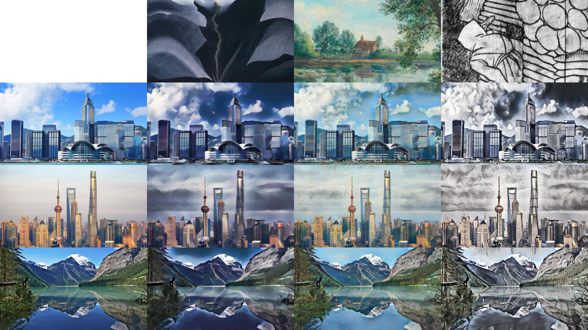

# Style Transfer with Style Attentional networks

Image style transfer using a style attentional network.

## Training

- install requirements with `pip install -r requirements.txt`
- get your kaggle API key from [here](https://www.kaggle.com/docs/api)
- start training with `python3 train.py`

### Arguments

- `content_dir` directory to content images (default to `data/content`)
- `style_dir` directory to style images (default to `data/style`)
- `vgg` pretrained vgg file (default to `pretrained/vgg.pth`)
- `lr` leaning rate
- `lr_decay` leaning rate decay
- `max_iter` maximum number of iterations (default to 160,000)
- `batch_size` number of image pairs in a batch
- `style_weight` style images weight (default to 3.0)
- `content_weight` content images weight (default to 1.0)
- `n_threads` number of threads used for the data loader (default to 2)
- `save_model_interval` interval to save models (default to 1000)
- `start iter` number of iteration to start training from (in case training was stopped)

## Testing

- run `test.py` with appropriate arguments

### Arguments

- `content` content image
- `style` style image
- `alpha` style content trade-off
- `vgg` path to pretrained vgg model
- `decoder` path to pretrained decoder
- `transformer` path to pretrained transfomer model

## More results

Style interpolation (merging 2 styles)

## References

- [D.Y. Park and K.H. Lee "Arbitrary Style Transfer with Style-Attentional Networks.", in CVPR, 2019.](https://arxiv.org/abs/1812.02342)
- [original paper implementation](https://github.com/mumair5393/Style-Transfer-with-Style-Attentional-Networks)
- [AdaIN implementation](https://github.com/naoto0804/pytorch-AdaIN)
